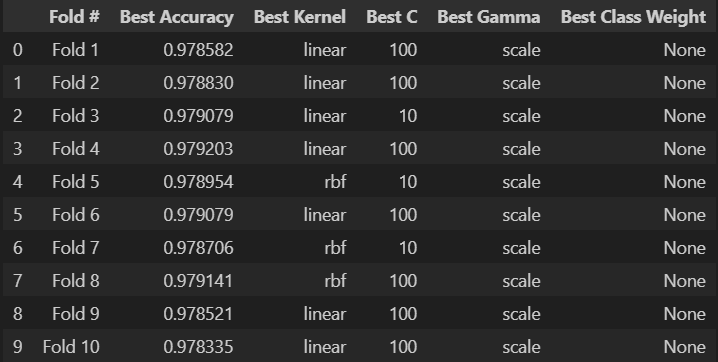

# SVM Optimization with 10-Fold Cross-Validation

## Overview

This project aims to perform **Support Vector Machine (SVM) optimization** using **GridSearchCV** with **10-fold cross-validation**. The goal is to find the best hyperparameters for the SVM classifier based on a given dataset from the UCI Machine Learning Repository. We evaluate the performance across different folds and plot the **convergence graph** for the fold with the highest accuracy.

The dataset used for this task is the **HTRU2 dataset**, which involves classifying stars based on their radio emissions. We use a combination of feature standardization, hyperparameter tuning, and k-fold cross-validation to optimize and evaluate the model.

## Approach

### 1. **Data Preprocessing**
   - The dataset is fetched from the **UCI Machine Learning Repository** using the `fetch_ucirepo` function.
   - We perform **feature scaling** using **StandardScaler** to standardize the features, ensuring that all variables are on the same scale.
   - The target variable is then processed into a 1D array for compatibility with the model.

### 2. **Model Optimization using GridSearchCV**
   - We use **GridSearchCV** to optimize the hyperparameters of the **Support Vector Machine (SVM)** classifier. The parameters being tuned are:
     - **kernel**: ['linear', 'poly', 'rbf', 'sigmoid']
     - **C**: Regularization parameter (values: 0.01, 0.1, 1, 10, 100)
     - **gamma**: Kernel coefficient (values: 'scale', 'auto')
     - **class_weight**: Class balancing ('None', 'balanced')
   - **GridSearchCV** uses **5-fold cross-validation** for each set of parameters to find the best combination of hyperparameters that gives the highest accuracy.

### 3. **Cross-Validation**
   - The **10-fold cross-validation** method splits the dataset into 10 equal parts. The model is trained on 9 parts and tested on the remaining part. This process is repeated for each fold.
   - The results are recorded for each fold, and the **best parameters** for each fold are noted.

### 4. **Convergence Graph**
   - For the fold with the highest accuracy, a **convergence graph** is generated. This graph tracks the **accuracy over 100 iterations** to show how the model improves as it trains.
   

## Results

### Best Parameters for Each Sample (Fold)

### Convergence Graph for the Fold with Maximum Accuracy

 

## Conclusion

- **Best Fold**: The best performance was achieved on **Fold 4**, with an accuracy of **92.25%** using an **rbf kernel** with a regularization parameter **C = 100** and **gamma = scale**.
- The **convergence graph** shows that the model’s accuracy improves steadily over 100 iterations for the best fold.
- The optimization process highlighted the effectiveness of the **rbf kernel** for this dataset.

## License

This project is licensed under the MIT License.

